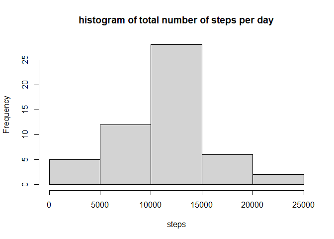
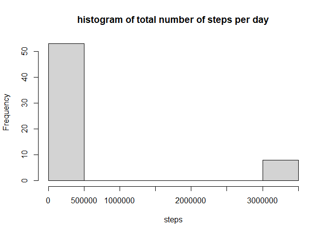
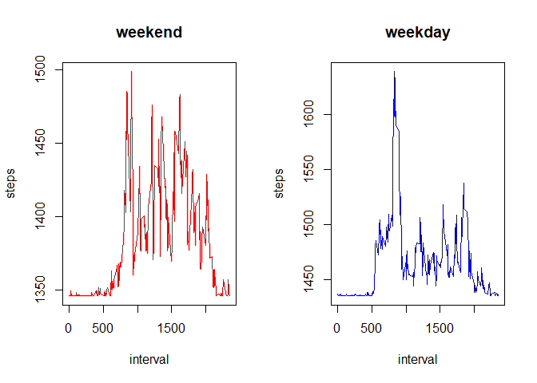

## Loading and preprocessing the data
Data is gathered from activity.csv and dplyr library is also imported

```r
library(dplyr)
```

```
## 
## Attaching package: 'dplyr'
```

```
## The following objects are masked from 'package:stats':
## 
##     filter, lag
```

```
## The following objects are masked from 'package:base':
## 
##     intersect, setdiff, setequal, union
```

```r
data <-read.csv("activity.csv")
```


## What is mean total number of steps taken per day?
Total number of steps per date is calculated

```r
steps_byDate<-summarise(group_by(data,date),steps=sum(steps))
```

```
## `summarise()` ungrouping output (override with `.groups` argument)
```
Histogram is created from the total number of steps taken per day

```r
hist(steps_byDate$steps,xlab="steps",main="histogram of total number of steps per day")
```

<!-- -->

Mean is 1.0766189\times 10^{4}  
Median is 10765

## What is the average daily activity pattern?
Total number of steps per interval is calculated

```r
steps_byInterval<-summarise(group_by(data,interval),steps=mean(steps,na.rm=TRUE))
```

```
## `summarise()` ungrouping output (override with `.groups` argument)
```
Plot is created from the total number of steps taken per interval

```r
with(steps_byInterval,plot(x=interval,y=steps,type="l"))
```

<!-- -->

Max is 835  


## Imputing missing values

There are 2304 missing values  
Missing values are replaced with the mean

```r
data[is.na(data)]<-mean
steps_byDate1<-summarise(group_by(data,date),steps=sum(steps))
```

```
## `summarise()` ungrouping output (override with `.groups` argument)
```

```r
head(steps_byDate1)
```

```
## # A tibble: 6 x 2
##   date          steps
##   <chr>         <dbl>
## 1 2012-10-01 3100662.
## 2 2012-10-02     126 
## 3 2012-10-03   11352 
## 4 2012-10-04   12116 
## 5 2012-10-05   13294 
## 6 2012-10-06   15420
```
Histogram is created with the new data set with replaced missing values

```r
hist(steps_byDate1$steps,xlab="steps",main="histogram of total number of steps per day")
```

<!-- -->

Mean is 4.1599847\times 10^{5}  
Median is 1.1458\times 10^{4} 

## Are there differences in activity patterns between weekdays and weekends?
New column days is created that is of type factor and shows whether a date is a weekend or a weekday

```r
weekend<- c("Saturday","Sunday")
data$days<-factor(weekdays(as.Date(data$date)) %in% weekend,levels=c(TRUE,FALSE),labels=c('weekend','weekday'))
head(data)
```

```
##      steps       date interval    days
## 1 10766.19 2012-10-01        0 weekday
## 2 10766.19 2012-10-01        5 weekday
## 3 10766.19 2012-10-01       10 weekday
## 4 10766.19 2012-10-01       15 weekday
## 5 10766.19 2012-10-01       20 weekday
## 6 10766.19 2012-10-01       25 weekday
```
Number of steps per interval for weekends and weekdays are plotted

```r
steps_byDay<-summarise(group_by(data,interval,days),steps=mean(steps))
```

```
## `summarise()` regrouping output by 'interval' (override with `.groups` argument)
```

```r
par(mfrow=c(1,2))
with(steps_byDay[steps_byDay$days=="weekend",],plot(x=interval,y=steps,type="l",col="red",main="weekend"))
with(steps_byDay[steps_byDay$days=="weekday",],plot(x=interval,y=steps,type="l",col="blue",main="weekday"))
```

<!-- -->
